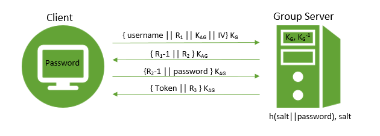
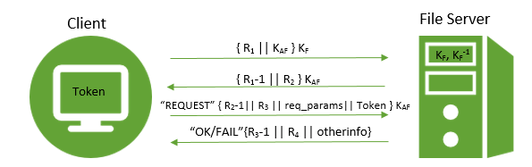
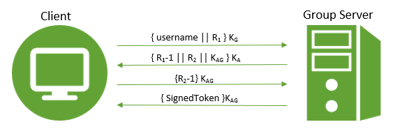

#Phase 3 Technical Write-Up
##Group Members: Gabe Larson, Terry Tan, Pauline Walsh
 
##Introduction
For this phase of the project, we plan to use a number of cryptographic techniques to address
the security threats described in each section. We plan to use asymmetric key cryptography in
the form of RSA encryption and signatures, as well as symmetric key cryptography in the form
of AES. The RSA encryption is used to provide confidentiality during the initial communications
between a client and a server. RSA is also used for authentication of the client tokens through
digital signatures.The mechanism we developed for authentication of the client to the group
server is similar to Needham-Schroeder, but does not require a third party. And lastly, the
symmetric key cryptography, specifically AES using CTR blocking, will provide confidentiality
during the rest of the communications between a client and a server.
 
##Mechanisms and Descriptions  
* <em>General Specifications for all Mechanisms</em>:
  * Any hash algorithm used will be SHA-256. The 256-bit length of the hash and the first and
  second preimage resistance properties of hashing ensures that it would take 2256 operations
  to perform a brute force attack which would allow an adversary to find a plaintext input that
  corresponds to the output of the hash function.
  * Any RSA private or public key will be 2048-bit length, since this length is declared by
  NIST to be safe until 2030. [1]
  * Any symmetric key algorithm used will be AES, using key sizes of 128-bit length, since
  this length is declared by NIST to be safe until 2030. (NOTE: We originally intended to implement
  256 bit keys but the (Windows) machiens that we will be demoing this phase on do not have java unlimited
  strength security installed on them). [2] 
  * Any AES will be encrypted in CTR block mode. ECB is unacceptable since a passive adversary can
  build up a codebook of blocks. CBC is undesirable since transmission errors can cause complete loss
  of data. CFB is undesirable since transmission errors in one block can affect the following block.
  Thus, between CTR and OFB, which are fairly similar, we chose CTR for its simplicity [5] and
  because it is parallelizable which can make it faster. The IV’s required for this mode will be
  generated using Java’s SecureRandom to minimize the possibility of sending a block encrypted in
  the same way twice (which would allow for a codebook attack).
  * All salts generated will be 64 bytes (256 bits long). Salts need to be generated to ensure enough
  randomness and variety to match SHA-256. Thus, it seems appropriate to have salts also be 256 bits long. [3]
  * All nonces and salts will be generated using Java’s SecureRandom. Java’s PRNG java.util.Random is not
  cryptographically secure. Thus, the SecureRandom class will be used to generate cryptographically strong RNG.
  [4] As stated above, salts will be 64 bytes long and nonces will also be 64 bytes long, since this provides
  over 1.1x1077 possibilities and thus should be safe to use.

###Threat 1: Unauthorized Token Issuance
 * <em>Threat Description</em>: Users may try to obtain tokens which they are not authorized to have,
 such as tokens belonging to another user. If Alice and Bob are two separate entities, Alice should
 not be able to obtain Bob’s security token. Otherwise, if Bob uses his group to store sensitive
 information such as credit card information, Alice could access and tamper with Bob’s information
 and thus use his credit card or incriminate Bob by uploading inappropriate files to the server.
 * <em>Proposed Defense Mechanism</em>:  
  * Regarding the defense mechanism, the following assumptions are made:
     * Only the user knows his or her password.
     * The group server is entirely trustworthy and thus its private key is uncompromised and
      has an uncompromised database of salted hashed passwords and corresponding salts.
     * The RSA public key of the group server will be asked for by the server right after connection. If the public
      key is not stored as a trusted key on the Client, then the user will be prompted whether or not they trust the key.
     * The client will receive a public RSA key from the group server which is up to the user to verify
   (via phone or some type of contact with administrator of the group server) that the public RSA key is correct.
     * The client does not store all salts used with every user’s password.
  * <em>Description</em>:  
     * _Figure 1: Diagram for Mechanism against Threat 1_
      
     * First, the Client sends their username, a nonce (a challenge), a generated symmetric
     key for the current session to the Group Server, and a randomly generated IV that is encrypted with the Group Server’s
     RSA public key.
     * The Group Server decrypts this information with their RSA private key. The Group Server
     looks up salt belonging to the user indicated in the first message. The Group Server sends
     back R1-1, and a new nonce R2 which are encrypted
     using the symmetric key KAG.
     * The Client receives the message decrypts the contents using the symmetric key KAG. The Client
     then also inputs password and sends back R2-1, guaranteeing freshness, and the
     hash to the Group Server encrypted using the symmetric key KAG.
     * Lastly, the Group Server receives and decrypts R2-1 and the user's password. Then, the server computes
     h(salt||password) and compares it against the hash stored in its secure database and confirms the two hashes match.
     Thus, the user has been authenticated. The Group Server generates a token and a signed hash of the token for the user
     which is stored in a field of that token (more details in threat 2 mechanism), concatenates that with a
     newly generated challenge for further communication and sends it back, encrypted using KAG. 

* <em>Why Mechanism Works:</em>
   * The correctness is based off the fact that if any of the messages or contents are altered, then the
   decrypted results and verification would fail. This protocol will only succeed in the end with the
   Token if the Client and GroupServer pass each other’s authentication challenges.
   * The security is ensured by RSA, the privacy of group server’s private key, symmetric key ciphers,
   the privacy of the user’s password and the group server’s database. Since the password is never sent
   into transit, it can never be intercepted and only the hash can be generated by brute force which is
   implausible to do.
   * The storage of salted passwords ensures security so that if there is a database breach and a user
   that does not have a secure password, their password is still safe and not vulnerable to lookup tables
   built off of commonly used passwords.

###Threat 2: Token Modification/Forgery
* <em>Threat Description</em>: Users may try to modify their existing tokens or forge new ones which will grant them higher access levels or access to groups which they have not been added to. A malicious outsider, knowing the format of a token, could fabricate his or her own token, giving themselves permissions to access, delete, or modify files, groups, or users. This is extremely problematic since an outsider could cause irreparable damage if the accuracy of a file is important (i.e. bank statements, medical history, etc.), or they could obtain sensitive information by giving themselves access to those files.  

* <em>Proposed Defense Mechanism</em>:
   * Regarding the defense mechanism, the following assumptions are made:
       * Group server’s private key is not compromised.
       * The administrators of the file servers will have verified the public key of the
       group server by speaking with the group server administrator.
       * An adversary has access to all methods and fields of a token.
   * Description:
       * Tokens will be signed by the group server before they are returned to a user. The token will have a toString
         method which   prints out the issuer name, the user name, and the groups (in alphabetical order to ensure
         that the toString method always returns the same string, regardless of the implementation of the group list).
         The token will also contain a signature field. To sign the token, the group server will hash the string which
         is returned from toString using SHA-256, and then use its private RSA key to sign the hash, and this signature
         will be saved in a field of the token.
       * The file server will have a config file containing the public key of the group server. This key should have
       been verified by the file server admin before they started it up. The file server will have a method for verifying
       RSA signatures based on the public key in this file, and it will run this method when it first receives a token
       from a user in order to verify the token’s integrity.
       * The file server method for verifying the authenticity of the token will hash the token’s String (obtained from
       the token’s toString method) using SHA-256 and comparing it with the value of the signature field that has been
       encrypted using the group server’s private key.

* <em>Why Mechanism Works:</em>
  * The preimage resistance of hashing ensures that the token could not have been modified, because a modification of the token would change the hash value. Furthermore, the operations of encryption and decryption are commutative. Performing them in either order will result in the original hashing.
  * The fact that the token was signed with the group server’s private key proves that the token came from the group server and could not have been forged. Thus, the security of this mechanism is based off of RSA.

###Threat 3: Unauthorized File Server
* <em>Threat Description</em>: An unauthorized file server may try to pose as a legitimate file server and intercept traffic from users. This could lead to users downloading malicious files, or uploading confidential files to the fake server. For example, Alice may want to download a seemingly harmless picture from an unauthorized file server. However, since the file server is malicious and unauthorized, she downloaded a file containing a virus. Furthermore, she may unknowingly upload personal documents with sensitive information to the untrusted file server. Additionally, a malicious file server might be able to copy the tokens which are sent to it and use them to try to access the real file server.
* <em>Proposed Defense Mechanism</em>:
   * Regarding the defense mechanism, the following assumptions are made:
       * The file server’s private key has not been compromised.
       * The group server’s private key has not been compromised.
       * The client will obtain and verify the file server’s public key upon connection and will be prompted whether or
       not they trust the key (up to the client to verify) if the key is not stored in a list of trusted keys.
   * Description:
       * Figure 2: Diagram for Mechanism against Threat 3
        
       * Before running the file server for the first time, the administrator will verify the group server’s public key by calling the group server admin. This key will be save in a config file on the file server.
       * The client will send a random challenge to the file server and a generated symmetric session key encrypted with the server’s public key  {R1 || KAF }KF
       * The file server will decrypt and return {R1-1 || R2} encrypted using the symmetric key.
       * The client will decrypt this and thus verify the File Server. For subsequent requests, the client will send its Token to the file server, concatenated with R2-1, a freshly generated challenge R3, as well as any request parameters, encrypted with the symmetric key.
       * Any subsequent response from the File Server will respond to the new challenge, generate a new challenge nonce of its own, as well as sending back any response data. This will also all be encrypted with the symmetric key.
       * Note: the previous two steps will be repeated continuously and provide implementation for mechanism 4.
       * Note 2: Any failed nonce response will result in the new nonce challenge sent with it not being stored. If not, a third party could implement a DoS attack simply by sending a request with a bogus challenge response.

* <em>Why Mechanism Works:</em>
    * The fact that the file server was able to decrypt the random challenge and send back R1-1 proves that the file server in in possession of its private key. No other party without the private key could do that. This authentication mechanism is based off of the security of RSA.

    * The fact that the client was able to complete the challenge by sending back R2-1 prevents any replay attacks by guaranteeing freshness.

###Threat 4: Information Leakage via Passive Monitoring
* <em>Threat Description</em>: A third party may passively monitor the information in transit and will seek to obtain message contents, file contents, and tokens for malicious intentions. If unencrypted files, tokens, or passwords are sent over a non-secure network, then any third party can monitor and extract the data in transit. As such, a third-party attacker may monitor the network and pull out any of the information, thus obtaining any tokens or files sent from the user to the file server or vice versa. In this way, a third party person may obtain files without ever directly connecting to the file server or can obtain more information from the server by using the token they stole to impersonate the original user to gain access to all their files on the file server.
* <em>Proposed Defense Mechanism</em>:
   - Regarding the defense mechanism, the following assumptions are made:
       * All communications in the system are monitored by a passive adversary.
   * Description:
       * All initial communications between the client and the group server will be encrypted. As described in detail in Mechanism 1, every message sent during the initial authentication is encrypted either using the group server’s public key or a generated shared symmetric key.
       * All initial communications between the file server and the client will be encrypted. As described in detail in Mechanism 3, every message sent during the initial authentication is encrypted either using the file server’s public key or a generated shared symmetric key.
       * All communication thereafter the authentication between client and servers will be encrypted using a symmetric key cipher by the symmetric key generated during the authentication protocols explained.
       * When used for authentication to the file server, the signed token will be concatenated with a response to a challenge from the file server to prevent a replay attack where the adversary copies the encrypted token during transit. The file server will close the connection.

* <em>Why Mechanism Works:</em>
    * Every message not encrypted with a symmetric key is still encrypted using either a user’s master key or a server’s public key.
    * This mechanism is secure  since all the keys are known to only the clients and/or the servers. Since we assume authorized file servers and the group server are secure, then the private keys of the servers are uncompromised and safe to use. Furthermore, since we assume the user is good at keeping their password a secret and that the group server’s database is secure, then the security of this mechanism is based upon the security of AES.

##Conclusion:  
We discussed a number of options to combat threats 1 and 3 before settling on the mechanisms described above. We initially talked about a mechanism based off Kerberos, but this seemed to be more complex than necessary for our current threat model. We also discussed using Needham-Schroeder, but this requires that a third party knows about the first two parties, which is at odds with our model which states that the group server should not need to know about every file server.  
Eventually we decided that we wanted a protocol that provided mutual authentication for the group server and the client, since even though the group server is entirely trusted now, that may not be the case in the future. We also decided that we do not want the user password to be transmitted every time the user requests a token. Instead, the hash of the password is used as a symmetric encryption key for the initial communication from the group server to the client. The client can use this key to decrypt the message, verify that the group server passed the challenge, and obtain a new symmetric session key that will be used for all future communications between the group server and client.  
We spent a good deal of time thinking about threat 4, and the replay attacks that might be possible if a passive adversary is monitoring all communications. Initially we planned to send the encrypted token by itself to the file server for authentication of the client. However, it seems that an adversary could copy that token and reuse it, so we decided to concatenate it with a decremented nonce sent as a challenge from the file server.  
After meeting with the professor, we researched for details on the standards of RSA and AES protocols. Furthermore, threat 1’s mechanism was altered so that the group server stored salted password hashes rather than just hashed passwords which increases the security of the mechanism. The user can no longer generate hash(salt||password) since we assume the client does not store the salt for every user. Due to this change, the original mechanism was altered such that the Client provided a symmetric key for the session, since the group server could no longer encrypt its response using the user’s secret key.   
_Figure 3: original mechanism for threat 1 before changes:_ 
 
Furthermore, the threat 2 mechanism was altered to only user nonces and no timestamps. The original mechanism used a mixture of nonces and timestamps, which defeated the purpose of using nonces or timestamps.
  
##References
[1] https://danielpocock.com/rsa-key-sizes-2048-or-4096-bits  
[2] https://www.keylength.com/en/4/  
[3] http://www.codeproject.com/Articles/704865/Salted-Password-Hashing-Doing-it-Right  
[4] https://docs.oracle.com/javase/7/docs/api/java/security/SecureRandom.html  
[5] C. Kaufman, R. Perlman, M. Speciner. Network Security, Private Communication in a Public World, 2ed, 2002. pg95-104  
