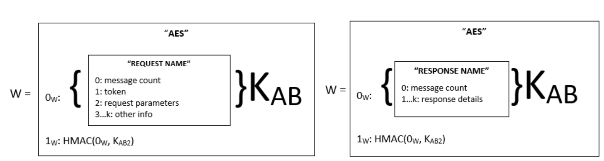
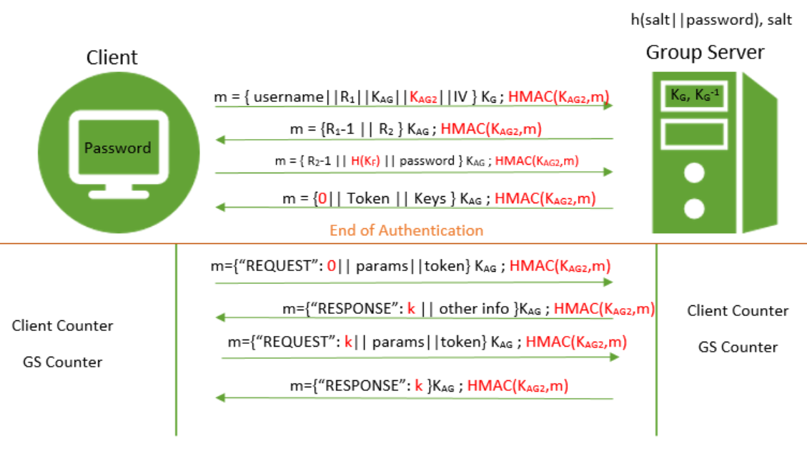
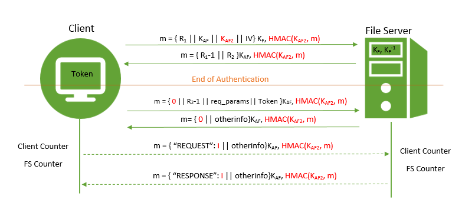
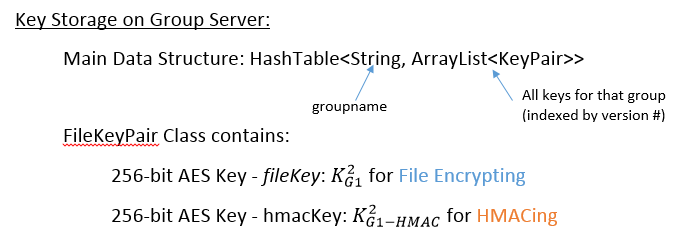
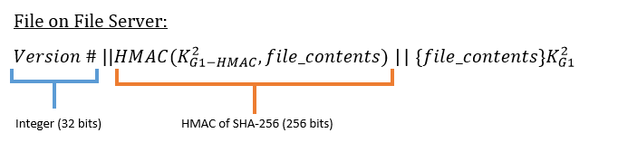
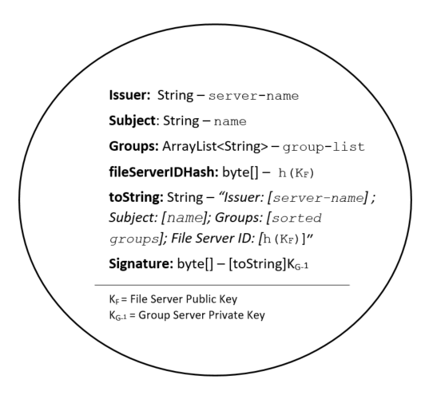

# Phase 4 Write-Up
### Group Members: Gabe Larson, Terry Tan, Pauline Walsh

## Introduction
For this phase on the project, we are building mechanisms to address three new threats, while maintaining security against the threats describe in the previous phase. Specifically, we will be using HMAC's (hashing combined with a secret cryptographic key) to provide integrity, counters and nonces to protect against replay and reorder, symmetric key encryption (AES) of files to protect against file leakage, and RSA signatures over a token that contains a file server ID in order to protect against token theft and re-use of tokens on different servers.

## Mechanisms and Descriptions
#### General Specifications for All Mechanisms:
* Any hash algorithm used will be SHA-256. The 256-bit length of the hash and the first and
second preimage resistance properties of hashing ensures that it would take 2256 operations
to perform a brute force attack which would allow an adversary to find a plaintext input that
corresponds to the output of the hash function.
* The keyed-hash message authentication code (HMAC) that we'll be using will be HMAC-SHA-256. This will be used with a 256-bit length AES key (to match the use of 256-bit AES below). It makes 'sense' to use a 256-bit key for a 256-bit hash.
* Any RSA private or public key will be 2048-bit length, since this length is declared by
NIST to be safe until 2030. [1]
* Any symmetric key algorithm used will be AES, using key sizes of 256-bit length, since this length is declared by NIST to be safe beyond 2030. [2]

* Any AES will be encrypted in CTR block mode. ECB is unacceptable since a passive adversary can
build up a codebook of blocks. CBC is undesirable since transmission errors can cause complete loss
of data. CFB is undesirable since transmission errors in one block can affect the following block.
Thus, between CTR and OFB, which are fairly similar, we chose CTR for its simplicity [5] and
because it is parallelizable which can make it faster. The IV’s required for this mode will be
generated using Java’s SecureRandom to minimize the possibility of sending a block encrypted in
the same way twice (which would allow for a codebook attack).
* All salts generated will be 32 bytes (256 bits long). Salts need to be generated to ensure enough
randomness and variety to match SHA-256. Thus, it seems appropriate to have salts also be 256 bits long. [3]
* All nonces and salts will be generated using Java’s SecureRandom. Java’s PRNG java.util.Random is not
cryptographically secure. Thus, the SecureRandom class will be used to generate cryptographically strong RNG.
[4] As stated above, salts will be 32 bytes long and nonces will also be 32 bytes long, since this provides
over 1.1x1077 possibilities and thus should be safe to use.

* Before a client interacts with a server, the Client sends the Server a `GETKEY` command to obtain the server's public key. It is entirely up to the user to verify the key offline (via phone, SMS, in person, etc.) The user will be prompted by the Client whether or not they trust the key. If the user does not trust the key, the connection will be terminated. After accepting the key once, the Client will store this key together with the server ip address and port number in a file called TrustedKeys.bin. The client reads this file on startup, and will automatically accept address/key pairs which are stored in it during future sessions.
* All messages between a server and client will be encrypted with 256-bit AES (except for 'GETKEY', which is plain text, and the first message from a client to server, which uses RSA encryption). Messages include a nonce and/or counter, as well as an HMAC. See the diagram below:

_Figure 1: Diagram of how envelopes and messages will be structured_  

* In the diagram above a "box" represents an "Envelope" object.
* Entire envelopes will be encrypted and put into other envelopes. This is done primarily to mark with the envelope message ("AES") that a decryption needs to take place, and to allow the HMAC to be verified before decryption (thus saving the expense of the decryption if the inner envelope has been tampered with).
* The above diagram refers to layout of how the messages will be structured. Where 0W (W for "wrapper" - the outer envelope) is the first index of an Envelope's contents. Then the HMAC is the second component of the wrapper Envelope's contents which is the HMAC of the entire inner encrypted inner envelope.
* The inner contents (count number, token, etc.) are indexed within the inner boxes in the diagram above.

###  Threat 5 - Message Reorder, Replay, or Modification
  <b>Threat Description</b>: An adversary may actively try to attack the system by reordering, replaying, or modifying messages. Replay attacks may be attempted with both single messages and entire sessions. Users and servers now need a way to detect these three conditions and handle them properly.

  Proposed Defense Mechanism: <em>Counters, Nonces, and HMAC</em>
  * Assumptions for this Mechanism:
      * We assume an asynchronous environment (however, the initial authentication handshake must be synchronous or it will fail)
      * Attacker has access to ALL messages sent over the network.
      * An attacker may try to replay single messages or may try to record an entire session of a user-server interaction and replay that entire session.
      * The file server and group server possess uncompromised private keys.

       
    _Figure 2: Diagram for Group Server Mechanism against Threat 5_ 
    
      
  * Overview for Group Server Authentication:
      1. The client first sends a message with a username, nonce, two AES Keys (KAG for encrypting the rest of the session messages, and KAG2 for HMAC) as well as an initialization vector for formatting. This is all encrypted with the File Server's public RSA key, so that only the File Server can accurately read the decrypted contents. This is all sent with the HMAC version of the encrypted message, hashed using KAG2, to protect the integrity of the first message. The server receives this message, decrypts it using its private RSA key. It extracts out the components. <u>`HMAC verification procedure`</u>: <em>Then, using KAG2 it computes the HMAC of the entire decrypted message. It checks this against the HMAC that was sent with the encrypted message. If it does not match, the server will send back a failure message and terminate the connection. </em>
      * The server then sends back the challenge response (providing freshness) which verifies the server's identity to the Client since only server could have decrypted the initial nonce that the client sent. The server also sends back a new nonce challenge for the client. These nonces are placed in an envelope, This message is all encrypted with KAG using AES.  This encrypted envelope is HMAC'ed using KAG2 and the encrypted envelope and HMAC are both placed into a "wrapper" envelope and then sent (See Figure 1 for details about the envelope structure.)
      * The Client receives an envelope containing an inner, encrypted request envelope and the HMAC of the inner envelope.  The HMAC verification procedure is then performed (outlined above). If the procedure is successful, then the client will continue and decrypt the inner envelope. Next the client will check that the nonce response is correct. If either the HMAC or the nonce fail, the client will inform the user and terminate the connection.
      * Next, the client will send back the new nonce response to guarantee freshness, as well as the hash of the File Server's public key that they wish to connect to (****see Mechanism 7 for more details) and their password. Then, this message is encrypted and "wrapped" as in Step 2 and per Figure 1. After sending this message, the client starts up two message counters:  one for incoming and one for outgoing, and sets them both to 0. Any new messages sent will include the outgoing counter and then increment it, and all incoming messages will be checked to make sure that the counter matches the client incoming counter, which will be incremented if there is a match.
      * The Group Server receives the message, verifies the HMAC, decrypts, and verifies the nonce response, terminating the connection if either step fails. The Group Server stores a HashTable of usernames that map to salts and the corresponding hashes of the salted passwords. The Group Server computes h(salt||password) using the password provided by the client and checks it against the one stored in the database. If this is successful, the group server will start two message counters, one for outgoing and one for incoming, and set them both to 0. Then the Server will add the counter, the user's Token and all of the user's Key's for their groups (****See Mechanism 6 for more details) to an envelope, which will be encrypted and "wrapped" with an HMAC as in previous steps before sending. The server will also add the counter to the outgoing counter to the message and then increment it.
      * All subsequent messages in either direction will include the entity's "outgoing" message count, and the receiver will always check that the counter matches its own "incoming" counter, and the server or client will terminate the connection and notify the user if a message is in the wrong order.      
 
   _Figure 3: Diagram for File Server Mechanism against Threat 5_ 
       
  * Overview for File Server Authentication:
      1.  The Client sends the File Server a nonce, two AES Keys (a session key KAG for encrypting the remainder of the messages in the session and an HMAC key KAG2) and an Initialization Vector for formatting. This is all encrypted using the File Server's public key. Furthermore, an HMAC of the encrypted message is sent with this as well.
      * The File Server receives the message, extracts and decrypts all components and then performs the HMAC verification procedure (outlined above). The Server then computes the response to the nonce and a generates a new nonce and sends these back, encrypted with the session key KAG and sent along with an HMAC of the encrypted contents. After sending the message, the server starts two counters at 0 (incoming and outgoing message count).
      * The client receives the message, verifies the HMAC, and then decrypts the inner envelope and extracts the components.  It verifies that the nonce response is correct. At this point, the client starts two counters at 0 (incoming and outgoing message count). Messages from this point on will all include the outgoing count, and will be sent in wrapper envelopes which contain the HMAC of the encrypted message envelope, as described in Figure 1.
      * The first request sent by a client after the server authentication is complete will include the response to the nonce challenge that the server sent back in Step 2. The server will have a flag variable to indicate whether this challenge has been completed successfully and require the challenge to be completed with the first request in order to maintain the connection. This provides defense against replay of an entire session.
      * All subsequent messages in either direction will include the entity's "outgoing" message count, and the receiver will always check that the counter matches its own "incoming" counter, and the server or client will terminate the connection and notify the user if a message is in the wrong order.     

  * Relevant Overview for this Threat:
      * Reorder and replay are protected against by numbering the messages after authentication. Once authentication finishes, both the server and client start two message counters, initialized to 0. So, there will be a total of four counters (incoming and outgoing from both perspectives). The number of the current message will be included in all encrypted messages sent between client and server after the authentication phase.
      * When a Client sends a message, it increments the Client's Client counter. When a Client receives a message, it increments the Client's Server counter. When a Server receives a message, it increments the Server's Client counter, and when a Server sends a message, it increments the Server's Server counter.
      * If a server or client receives a message that is out of order, it will immediately terminate the connection.
      * Session replay is protected against by using a challenge and response between the client and server during authentication. The first message sent from client to server contains a 256-bit nonce generated using Java's SecureRandom class. The reply sent from the server to the client contains a response to the challenge, as well as a new challenge. The client then responds with its answer to the server challenge, concatenated with the other information that makes up the request.
      * To protect against message modification, a second key, KAG2, is sent with the first message that a client sends to a server. This key is used to HMAC all subsequent messages between the server and client to ensure the integrity of the messages. The entity receiving the message will use the HMAC to ensure that the encrypted message has not been modified before it decrypts the message contents (excluding the first message, which must be decrypted first to obtain the HMAC key). Upon detecting a modified message, the connection will be immediately terminated.

  * Why Mechanism Works:
    * All messages after authentication are numbered, starting at 0. If an attacker tries to replay a message which does not match the counter that the receiver is maintaining (server or client), then the connection will be terminated.
    * It is highly improbable that a challenge generated with SecureRandom will repeat. If an adversary tries to replay all of the client messages to the server, the nonce response in the second message sent from client to server will not match the new nonce which has been generated by the server for the current session, and the server will terminate the connection. Likewise, if an adversary tries to replay all of the server messages to the client, the first message from server to client will contain a stale challenge response, and the client will detect that the response is not correct and then terminate the connection.
    * Everything sent across the channel is encrypted and includes an HMAC. The HMAC is fine to include unencrypted as it does not provide an attacker any extra information due to the property of preimage resistance of a hash.
    * The HMAC of a message cannot be computed without the secret key. The secret key is generated by the client at the start of each session and encrypted with the server's public key when it is sent to the server. No other entity could recover the key without possessing the server's private key, so we know that only the client and the server can produce a valid HMAC for a message. The second preimage resistance property of a cryptographically strong hash function ensures that it would be computationally infeasible for an attacker to find a message that would produce the same HMAC as another message which they are trying to modify/replace, so it's highly unlikely that an attacker could  modify or replace the message without being detected.

###  Threat 6 - File Leakage
  <b>Threat Description</b>: A file server may transmit files to unauthorized users. We must ensure that the files will not be readable by anyone who is not a member of the appropriate group.

  Proposed Defense Mechanism: <em>Encryption keys for each group, stored on group server</em>
* Assumptions & Specifications:
  * The group server does not know about all of the file servers which exist.
  * The file server administrators do not know how many other file servers may exists which host files for the same groups.
  * The file server administrators are untrustworthy and may try to transmit files without the proper authorization (token) or my try to maliciously modify files.
  * Any current member of a group can see any and all files that belong to the group.
  * When a member is removed from the group, the focus is to prevent them from decrypting new files, newly updated files, and recently accessed files.
   

* Description:  
  _Figure 4: Diagram for database of keys on groupserver_ 
   
    * <u>General idea</u>: Individual keys for individual groups.
    * Note: Going beyond a single key for encrypting a file, we want to protect a File Server from maliciously modifying a file as well and allowing the Client to be able to detect this. For this, we use a second key for HMACing. Thus, these two keys will be stored together in a `FileKeyPair`.
    * The group server will maintain a database of AES group FileKeyPairs. A FileKeyPair contains both a 256-bit AES key for encrypting files and a 256-bit AES key for HMACing the unencrypted contents of the file for integrity. For each group, there will be a list (ArrayList indexed by version number of the key) which contains all their FileKeyPairs which have been ever been used for that group. When a user is removed from a group, a new FileKeyPair will be created for the group and added to the list of keys for the group. (i.e. TWO new AES keys will be generated, one for encryption and one for HMACing)
    * All groups will have a symmetric key to be used for file encryption, which will each be created when a new group is created. When a user requests a token from the group server, they will also receive keys for all of the groups of which they are a member (the keys will have indications of what group they for and what version the key is). Files will be encrypted with the appropriate key before they are uploaded to the file server. Files that are downloaded from the server will be decrypted using the key for the appropriate group. 
    * Upon finishing authentication with the Group Server, a user will receive its token and all the keys (current and old versions) for the groups in which they belong. For each group, they will receive an ArrayList of keys, indexed by version numbers. Using this, the user will build a HashMap for their own groups to use that maps groupnames to ArrayList<KeyPair>  
      _Figure 5: Diagram of what stored files look like on FS_ 
       
    * The file will be stored with a value (Java integer - 32 bits) which indicates which version of the key was used to encrypt it. It will also be stored with the HMAC of the unencrypted contents using the HMAC key of the corresponding version. When a user tries to download a file, the application will check the key version and decrypt it with the corresponding key.
    *  After the user downloads the file and decrypts it with the old key, it will verify that the hash (or HMAC) matches the hash stored with the file.
    * If the file is encrypted using an old key (i.e. the index does not match the value of the ArrayList's size-1), to update the file on the file server, the file will then be re-encrypted with the newest key by the user. The old version of the file will be deleted from the server, and the version encrypted with the newest key will then be re-uploaded to the server via a `REUPLOAD` command.

* Why Mechanism Works:
    * Since the file server does not have the key used to encrypt the file, it does not have access to any of the contents nor does any entity that the file server tries to leak the file to.
    * Additionally, the HMAC provides integrity, since only the group server and the group members possess the HMAC key, and if either the HMAC or contents are altered, this is detectable by any group member who can compute the HMAC of the encrypted file and verify that it matches the stored HMAC.
    * Since group servers and clients do not know about every file server that a group hash files on, we can at least update files as we download files from file servers that are still encrypted with old keys. If a group member left that had access to the file before, there is no guarantee that they already have the file anyways. So the main goal is to protect new files and updated files, while updating our old files as they are accessed by current group members.

###  Threat 7 - Token Theft
<b>Threat Description</b>: A file server may attempt to steal a token from a specific client and try to give it to another client. We must make sure that the token token is only valid to use on the server from which the token was stolen.

Proposed Defense Mechanism: <em>Token string signed by group server contains a file server ID</em>

* Assumptions/Specifications:
    * A user will try to connect to a group server AND file server simultaneously. Thus, we assume that while trying to authenticate with the Group Server, the client has already obtained both public keys of the respective Group and File servers they wish to connect to.
    * A file server must obtain the group server's public key and verify it offline. Before starting the file server, the administrator must connect to the group server, obtain its public key, and verify it offline (phone, email, SMS, etc.) We implemented this in a program called `GetGSPubKey` that needs to run before the File Server starts.
    * Description:
      _Figure 6: Overview of Token and its methods_
      
    * When a client performs the authentication process with Group Server (See figure 2 from Threat 5), they will also pass a hash of the file server's public key to the group server.
    * The Token class will be modified to include a new field that contains the hash of the File Server's key. This field will be included in the toString() method.
    * From the previous mechanism for Threat 2 (in phase 3) the Group Server signed the hash of the toString() of the token. Since we're now including the FileServerKeyHash into this toString, we can guarantee that it has not been altered. So the toString() Method will look like the following: (Example where the issuer is "ALPHA", the subject is "alice", and she is part of groups "ADMIN", and "everyone", and "friends")
      * Issuer: ALPHA; Subject: NAME; Groups: ADMIN, everyone, friends; FSKeyHash: f17c1ff8b42bdb0949b54f98e86e25f805533013406439428dc2afe7975b8f32
      * NOTE: The groups will ALWAYS be listed in alphanumerical order. So, a person who is a member of only of "ADMIN" and "everyone" will always have it listed as: "ADMIN, everyone" but never the reverse.
    * This toString() for the token is what will be serialized and signed by the Group Server using its private key.
    * Using this unique identifier for the File Server, whenever a file server performs a check to see if a token has been modified (also from mechanism 2 in phase 3), the file server will also now check the FileServerKeyHash field to make sure that the hash of its own public key matches with this field.
      * To check to see if a token has been modified, a File Server will compute the hash of the toString() of a token (Q1). Then, the file server which has the group server's public key in storage will then "encrypt" the signature field in the token with the group server's public key(Q2). It will see if these two quantities (Q1 and Q2) match. If so, then the signature is valid, if not, then the token is not valid.

* Why Mechanism Works:
  * The inclusion of the hash of the key into the toString method that is signed by the Group Server guarantees integrity. Since the File Server can be assured that the token has not been altered, specifically the FileServerKeyHash field, then the File Server can validate that this token was created only for that particular File Server.
  * This mechanism works, because a stolen token for a particular file server will contain a different key (and thus, a different hash of the key) from any other existing file server. Since a File Server can reliably check to see if the token was created for that File Server, it can deny service if it does not match.

  ## Discussion of Process
  - Firstly, for this sprint we discovered that we could encrypt entire envelopes (which when we tried to do previously, ended up dropping all contents inside the envelope) The entire base code had to be rehauled for this, since this discovery allows us to encrypt the entire envelope (and the message on the "outside" of it) which we wanted to keep a secret but were unable to during the last phase.

  - Threat 7 was very straight forward to plan and implement for. Threat 5 was slightly more challenging. From our previous mechanisms for the last phase, we went overboard with nonces which need to be removed. Furthermore, our naive nonce implementation only prevented replay attacks. We added HMACs to provide integrity that the messages were not being modified. Furthermore, we simplified the nonces down to only the authentication protocols and then used a simple numbering system.
  - Threat 6 was the most difficult and require the most brainstorming in order to plan for and deal with. The basic idea of "individual keys for each group" was sound. However, the devil is in the details, and we were unsure how to deal with maintaining security as members left the group.
    * We assumed that if files were available to a user while they were still in the group, there's no guarantee that they didn't download it before they left. Additionally, since a Client or Group Server did not have access to every File Server that hosted files for a particular group, we gave up on the idea of finding every encrypted file for the server and decrypted/re-encrypting it to update those files.
    * Thus, our focus shifted towards maintaining the security of new files in the group, newly updated files of a group, and recently accessed files of a group.
    * Since a file could be stored on an old dusty file server for a long time before being accessed again, we figured we should store old keys on the group server. In order to update those files, the only time we are guaranteed access to them is when the Client is accessing the File Server. We contemplated having a Client do a massive update to all the files (that a user has access to) on a File Server after authenticating to a File Server, however this seemed like it may be too much work. Thus, if a Client downloads an old, unupdated file, since they already did half the work of decrypting the file, it makes sense to have the client reencrypt with the new key, update it, and send it back to the File Server to be replaced.
    * For this threat, we added on an extra functionality to be able to detect if a File Server has modified a file. This required the use of an HMAC and an additional key for every group for every version. Thus, we added the FileKeyPair class for this purpose.

  ## Discussion of Phase 3 Threats
  - Threat 1: Unauthorized Token Issuance
    * The group server still requires the user to provide proof that the user is the user (through the use of a password) and verifies it against its database of stored and hashed passwords before issuing a token. If this does not match, then the group server will not give out the token.
  - Threat 2: Token Modification/Forgery
    * The token is still signed using the group server's private key to ensure integrity. A file server still verifies this signature before accepting the token for any command. (See Threat 7 for more details) The toString() method includes all important fields that a user would modify (the two most important being user and groups)
  - Threat 3: Unauthorized File servers
    * A user still needs to verify a file server's public key after receiving it using the `GETKEY` call (offline by calling administrator, emailing, etc.). Furthermore, the nonces in the authentication prevent a replay attack of an authentication session. Thus, a malicious file server cannot pose as another file server who's public key is trusted by the user. (See Threat 5 Mechanism for more details)
  - Threat 4: Information Leakage via Passive Monitoring
    * Aside from the GETKEY method from the client/server (passing around public information anyways), every other single interaction between client and group or file server is always encrypted with RSA (first message in authentication protocols), AES (any messages that are not authentication or not the first message of authentication), or HMAC (useless information due to preimage resistance of hashes). Furthermore, this phase is even more secure since the "REQUEST" on envelopes is now encrypted as well since we've figured out how to encrypt entire Envelopes.

## References
[1] https://danielpocock.com/rsa-key-sizes-2048-or-4096-bits  
[2] https://www.keylength.com/en/4/  
[3] http://www.codeproject.com/Articles/704865/Salted-Password-Hashing-Doing-it-Right  
[4] https://docs.oracle.com/javase/7/docs/api/java/security/SecureRandom.html  
[5] C. Kaufman, R. Perlman, M. Speciner. Network Security, Private Communication in a Public World, 2ed, 2002. pg95-104  
