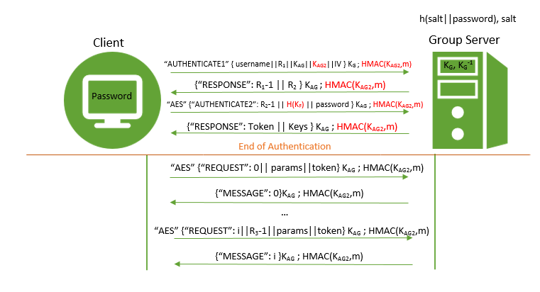
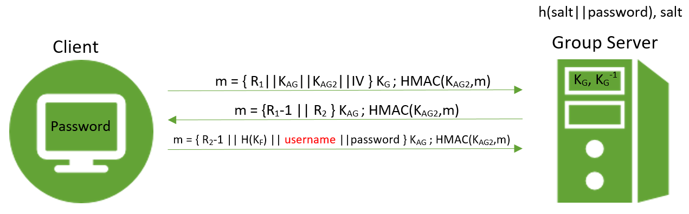

# Phase 5 Write-Up
### Group Members: Gabe Larson, Terry Tan, Pauline Walsh

## Introduction

Before deciding to defend against online password guessing, we discussed a number of other avenues of attack that our system could be threatened by, such as codebook attacks on the file encryption (due to using the same IVs for different files), denial of service attack, and malicious keyloggers. It was enlightening to think about our project from the perspective of an adversary, and really enforced the idea that small details in implementation can create large security holes. In the end, online password guessing was a good threat to focus on, because this type of attack could do more damage with less effort than the other threats we discussed. Also, our implementation of authentication between the client and group server was particularly vulnerable to this type of attack, so it made sense to implement this a defense for this.

#### General Specifications for All Mechanisms:
* Any hash algorithm used will be SHA-256. The 256-bit length of the hash and the first and
second pre-image resistance properties of hashing ensures that it would take 2256 operations
to perform a brute force attack which would allow an adversary to find a plaintext input that
corresponds to the output of the hash function.
* The keyed-hash message authentication code (HMAC) that we'll be using will be HMAC-SHA-256. This will be used with a 256-bit length AES key (to match the use of 256-bit AES below). It makes 'sense' to use a 256-bit key for a 256-bit hash.
* Any RSA private or public key will be 2048-bit length, since this length is declared by
NIST to be safe until 2030. [1]
* Any symmetric key algorithm used will be AES, using key sizes of 256-bit length, since this length is declared by NIST to be safe beyond 2030. [2]
* Any AES will be encrypted in CTR block mode. ECB is unacceptable since a passive adversary can
build up a codebook of blocks. CBC is undesirable since transmission errors can cause complete loss
of data. CFB is undesirable since transmission errors in one block can affect the following block.
Thus, between CTR and OFB, which are fairly similar, we chose CTR for its simplicity [5] and
because it is parallelizable which can make it faster. The IV’s required for this mode will be
generated using Java’s SecureRandom to minimize the possibility of sending a block encrypted in
the same way twice (which would allow for a codebook attack).
* All salts generated will be 32 bytes (256 bits long). Salts need to be generated to ensure enough
randomness and variety to match SHA-256. Thus, it seems appropriate to have salts also be 256 bits long. [3]
* All nonces and salts will be generated using Java’s SecureRandom. Java’s PRNG java.util.Random is not
cryptographically secure. Thus, the SecureRandom class will be used to generate cryptographically strong RNG.
[4] As stated above, salts will be 32 bytes long and nonces will also be 32 bytes long, since this provides
over 1.1x1077 possibilities and thus should be safe to use.
* Before a client interacts with a server, the Client sends the Server a `GETKEY` command to obtain the server's public key. It is entirely up to the user to verify the key offline (via phone, SMS, in person, etc.) The user will be prompted by the Client whether or not they trust the key. If the user does not trust the key, the connection will be terminated. After accepting the key once, the Client will store this key together with the server ip address and port number in a file called TrustedKeys.bin. The client reads this file on startup, and will automatically accept address/key pairs which are stored in it during future sessions.
* All messages between a server and client will be encrypted with 256-bit AES (except for 'GETKEY', which is plain text, and the first message from a client to server, which uses RSA encryption). Messages include a nonce and/or counter, as well as an HMAC. See the diagram below:

## Threat Model
* <b>Group Server</b> -  The group server is entirely trustworthy. This means that the group server will only issue tokens to properly authenticated clients and will properly enforce the constraints on group creation, deletion, and management specified in previous phases of the project. The group server is not assumed to share secrets with the file servers in the system. Furthermore, we assume that the Group Server's key is uncompromised.
* <b>File Servers</b> - File servers will be assumed to be largely
untrusted. In particular, file servers might leak files to unauthorized users, attempt to steal user tokens, or maliciously modify files.
* <b>Clients</b> - We will assume that clients are not trustworthy. Clients may attempt to obtain tokens that belong to other users and/or modify the tokens issued to them by the group server to acquire additional permissions. Additionally, we may assume that a client may try to use a short or common password, so that it is easier for them to use and remember.
* <b>Other Principals</b> - It is assumed that all communications in the system might be intercepted by a active attacker that can insert, reorder, replay, or modify messages. Furthermore, we assume that an attacker may try to brute force or heuristically guess username and passwords.

## Attack Descriptions
#### Attack 1: Online Password Guessing
  * General Description: An adversary my attempt to brute force a password for a known user. Currently in our system, the user can put in a username with no password and it will return “OK” if the user exists or “FAIL” if there is no user. Because of this, an adversary could guess and guess until a user name is found.
  * How to Attack:
      * An adversary first needs to get an existing username, this could be done by guessing randomly, brute force, or by being lucky and hearing a username for the system. This step can be repeated until a username is found because there is currently no penalty for excessive guesses.

      _Figure 1: Old Group Server Authentication_
        
      * Due to our previous mechanism, a client could constantly guess a username and be told whether it existed or not, since username and password were sent separately.
      * Once a username is known, an adversary could iterate through a list of 1000 most commonly used words as password guesses. Again, this could continue for as long as an adversary is willing because there is no penalty.
      * The adversary could also attempt a brute force attack of all possible combinations. This would especially be vulnerable if a password is short

## Defense mechanisms

#### Mechanisms for Attack 1

  * **Sub-Mechanism 0: Revamp of Group Server Authentication**
    * Assumptions:
      * Group Server authentication is implicitly synchronous, but any messages following successful authentication can be asynchronous.
      * We assume that the Group Server's private key is uncompromised, since the Group Server is assumed to be secure.
    * Description:  The password should be sent in the same message as the username, and the information returned to the client should not indicate which of the two is incorrect in the case of a failed combination.
      _Figure 2: New Group Server Authentication_
    
    * General overview:
      * The first message is send with a nonce challenge, a symmetric key (session key for messages) for the rest of the communication in the current session, another symmetric key (session key for HMAC-ing), and an Initialization vector for formatting. This is all encrypted with the group server's public key. This is all HMAC'ed with the HMAC key for integrity.
      * The server responds with the nonce response, and a new nonce encrypted with the session key. This also has an HMAC for integrity.
      * The Client responds with a response to the new nonce, a hash of the key of the file server it wishes to connect to, and the username and password. This is all HMAC'ed again to guarantee integrity.
    * Changes made:
      * The first two messages from the client will be altered as in Figure 2, moving the username to the second message.
      * If either the username or password invalid, the group server will send back a "FAIL" message which indicates an invalid combination, but does not offer any information about which of the two failed.
    * Why it works:
      * There are many more combinations possible when username and password are considered together rather than separately. With this mechanism we do not allow an adversary to repeatedly guess just usernames until it finds a "hit".
      * Furthermore, a replay attack would not work since the response to the nonce guarantees freshness. If an attacker were to try to replay this, the server would not generate (extremely unlikely it would generate the same nonce R2) the same nonce, and thus the same message from the Client would give the wrong response to the nonce and make the authentication invalid.
      * Also, without the Key AAG an attacker cannot regenerate the username and password.
      * Note: This method does NOTE provide Backward Secrecy in the event that the Group Server's key is compromised, but we assumed that the Group Server is secure and has an uncompromised key. Furthermore, the session key should not be stored anywhere permanently. Thus, after the session, the session key should be thrown away by both the client and server.

  * **Sub-Mechanism 1: Timeout**
    * Assumptions:
      * We assume that the Group Server's clock is untampered since the Group Server is secure. To assess timestamps, all a group server checks is its own clock.
    * Description:
      * A new class, UserStatus, will hold information about a user's failed login attempts and timeout status.
      * A hashtable in the group server will map usernames to UserStatus objects.
      * After 3 incorrect passwords for any given user, the user's status object will be updated to include a timestamp for the time of the third attempt.
      *  When a user tries to login, first their timeout status will be checked. If there is a timestamp in the user status object which is less than 15 minutes old, the user will not be permitted to log in. The server will send back a message indicating that the user account is currently on time out.
      * Note: The UserStatus information is not retained when the group server is restarted, with the reasoning that the group server will not be restarting often, and allowing any user an extra three "free" attempts before a timeout after the occasional restart will not have any noticeable impact on the ability of an adversary to break a username/password combination.
    * Why it works:
      * This mechanism makes it so that an adversary would have to spend an incredible amount of time to succeed in a brute force attack.

  * **Sub-Mechanism 2: Enforcing 'Secure' Passwords**
    * Assumptions:
      * Periodically, we assume the moderator is updating this list of most common passwords with findings of newer lists and common passwords.
    * Description: We make sure that passwords are more difficult to obtain by systematic brute force methods.
        * Check that password length of is at least 9 characters long.
        * Check that password does not contain any words from the 1000 most popular words list.
        * Otherwise, refuse to create new users with passwords that are not of minimum length or that are on the most popular password list.
    * Why it works:
        * Having a minimum length of 9 increases the minimum size of the key space by a massive amount compared to before.
        * Furthermore, checking to make sure a password is not a "common" password also inhibits that heuristic method of attacking by guessing the most commonly used passwords.

  * **Sub-Mechanism 3: Allowing Users to Change Password**
    * Description: The longer a user uses the same password, the more likely it is to be compromised.
      * Add in a new command/request header to change password called "CHANGEPASS"
      * This would require the user's current password and new desired password.
      * The server will first check that the current password is correct. If not, then it will send back a fail.
      * The server will then check that the new password satisfies the requirements in sub-mechanism 2 (above). Specifically, that it has a minimum length of 9 characters and is not contained a list of 1000 most popular passwords.
      * The server will generate a new salt and compute the hash of the new salt concatenated with the new password and replace that entry to the corresponding use in the database.
        * New Entry: hash(new_salt || new_password) , new_salt
      * Note: Only a user can change his/her own password.
    * Why it works:
      * Statistically, the longer a user uses a key, the more likely it is to be compromised. So, while we do not enforce mandatory periodic password changes, we allow uses to have the option to change their password.

  ## References
      [1] https://danielpocock.com/rsa-key-sizes-2048-or-4096-bits  
      [2] https://www.keylength.com/en/4/  
      [3] http://www.codeproject.com/Articles/704865/Salted-Password-Hashing-Doing-it-Right  
      [4] https://docs.oracle.com/javase/7/docs/api/java/security/SecureRandom.html  
      [5] C. Kaufman, R. Perlman, M. Speciner. Network Security, Private Communication in a Public World, 2ed, 2002. pg95-104  
